# Current Architecture and ZKP Data Flow

This document describes the architecture that is actually reflected in the current codebase.

It is intended for:

- final dissertation system design
- implementation chapter alignment
- ZKP-focused architecture explanation
- separating current runtime behavior from planned or only partially integrated features

## 1. System Overview

The current prototype is best understood as a six-layer system:

1. local training scripts
2. Python SDK
3. backend relay service
4. smart contracts
5. frontend dashboard
6. IPFS / Pinata-backed off-chain storage

The operational center of gravity is:

`Training Script -> Python SDK -> Backend Relay -> Smart Contracts`

The frontend is not the main write path. It is primarily:

- a dashboard
- a registry view
- an audit inspection layer
- a demonstration interface over backend-exposed state

## 2. ZKP-Centered Architecture

The current codebase already contains a real ZKP-oriented submission path, but that path must be described precisely.

What the runtime does today:

- the SDK generates a Groth16 proof locally
- the SDK exports proof artifacts and Solidity calldata
- the SDK injects ZKP-derived fields into `trainingMetadata`
- the backend stores those fields through the provenance submission route

What the runtime does not do by default today:

- it does not route normal SDK submissions through `addZKProofRecord(...)`
- it does not require verifier-gated bridge settlement before a provenance record is accepted
- it does not use `RealZKBridge.sol` as the default write path for application submissions

So the current architecture is best described as:

- ZKP-aware at the application layer
- ZKP-generating at the SDK layer
- ZKP-testable at the circuit/verifier layer
- not yet ZKP-enforced as the sole default chain write path

## 3. Module Responsibilities

### 3.1 Local Training Scripts

Primary files:

- `train1.py`
- `train2.py`
- `train_v2_incremental.py`

Responsibilities:

- train or fine-tune local model artifacts
- maintain a stable `model_series` lifecycle identity
- obtain a lifecycle secret through `ModelSecretManager`
- invoke the Python SDK after artifact creation

Boundary:

- these scripts do not talk directly to smart contracts
- they do not perform on-chain writes by themselves
- they rely on the SDK for hashing, proof generation, and submission

### 3.2 Python SDK

Primary file:

- `sdk/python/provenance_sdk.py`

Responsibilities:

- hash model files
- resolve model identity through backend APIs
- auto-register models when needed
- compute `messageHash` from submission context
- generate local Groth16 proof artifacts
- export public signals and Solidity calldata
- upload model artifacts to IPFS when credentials are available
- assemble `trainingMetadata`
- submit provenance through the backend relay

Boundary:

- the SDK is the main ZKP-processing layer in the current runtime
- it does not write directly to contracts
- it depends on the backend for authenticated application writes

### 3.3 Backend Relay

Primary file:

- `server/server.js`

Responsibilities:

- expose REST APIs to the frontend and SDK
- enforce write authentication using API key, timestamp, and nonce
- apply replay protection and rate limiting
- manage model registration through `ModelRegistry`
- relay provenance submissions through `ModelProvenanceTracker`
- expose status, registry, and audit data
- mediate Pinata-backed IPFS uploads
- maintain local model-name cache state in `model_name_map.json`

Boundary:

- the backend is the actual application core
- it accepts ZKP-derived metadata from the SDK
- it currently writes normal provenance records through `addRecord(...)`
- it is not yet the default verifier-gated bridge execution layer

### 3.4 Smart Contracts

Primary runtime-facing contracts:

- `contracts/ModelAccessControl.sol`
- `contracts/ModelRegistry.sol`
- `contracts/ProvenanceTracker.sol`
- `contracts/ModelAuditLog.sol`
- `contracts/ModelNFT.sol`
- `contracts/ModelStaking.sol`

Supporting but not default application-path contracts:

- `contracts/Verifier.sol`
- `contracts/RealZKBridge.sol`

Responsibilities:

- maintain model registry state
- control write permissions and roles
- append provenance records
- provide audit-verification support
- provide optional NFT and staking features
- expose bridge and verifier logic for the ZKP-oriented design

Boundary:

- contract-level capability is broader than the current application integration level
- contract presence does not automatically mean default runtime usage

### 3.5 Frontend Dashboard

Primary files:

- `client/src/App.jsx`
- `client/src/lib/api.js`
- `client/src/pages/*`

Responsibilities:

- display system status
- show model registry state
- render audit verification results
- expose backend write posture
- provide a demonstration-oriented system interface

Boundary:

- the frontend is not the main training execution environment
- it is not the full chain interaction surface
- it does not currently implement a full ZKP submission control plane

### 3.6 Off-Chain Storage

Current integration:

- Pinata API
- IPFS CID-based storage

Responsibilities:

- store model artifacts or metadata off-chain
- avoid placing large payloads on-chain
- return CIDs that can be referenced inside provenance metadata

Boundary:

- IPFS is auxiliary storage, not the source of verification logic
- the ZKP flow can still run even when SDK-side direct Pinata upload is unavailable

## 4. Current Runtime Topology

Current topology in code:

- active networks: `sepolia`, `tbnb`
- deployment address source: `address_v2_multi.json`
- frontend communicates only with backend APIs
- SDK communicates only with backend APIs for application writes
- backend communicates with contracts and Pinata
- local circuit tooling is executed from the SDK on the same machine

This means the real topology is backend-mediated, not direct client-to-chain interaction.

## 5. ZKP Runtime Data Flow

## 5.1 High-Level ZKP Flow

```mermaid
flowchart LR
    A["Training Script"] --> B["Python SDK"]
    B --> C["Hash Model Artifact"]
    C --> D["Resolve / Register modelId via Backend"]
    D --> E["Compute messageHash"]
    E --> F["Run Groth16 Proof Generation"]
    F --> G["proof.json / public.json / calldata"]
    B --> H["Optional IPFS Upload"]
    G --> I["Assemble trainingMetadata"]
    H --> I
    I --> J["POST /api/sdk/provenance"]
    J --> K["Backend Relay"]
    K --> L["ModelProvenanceTracker.addRecord(...)"]
    L --> M["Chain State"]
    M --> N["Frontend Audit / Registry Views"]
```

## 5.2 Detailed ZKP Submission Path

The current code-verified runtime sequence is:

1. A local training script creates or updates a model artifact.
2. The script requests a stable lifecycle secret from `ModelSecretManager`.
3. The SDK computes `modelHash` from the saved model file.
4. The SDK resolves the on-chain model identity through backend APIs.
5. If the model does not exist, the backend registers it through `ModelRegistry`.
6. The SDK computes `messageHash` from:
   - model name
   - chain
   - model hash
   - commit message
   - sender
   - version
7. The SDK writes `scripts/last_proof_input.json`.
8. The SDK runs `node test_zk_standalone.js`.
9. The proof flow produces:
   - `proof.json`
   - `public.json`
   - `proof_calldata_debug.txt`
10. The SDK optionally uploads the model artifact to IPFS through Pinata.
11. The SDK assembles `trainingMetadata`, including:
    - `message_hash`
    - `zk_verified`
    - `zk_engine`
    - `zk_public_signals`
    - `zk_calldata`
    - `ipfs_upload_mode`
12. The SDK sends the payload to `POST /api/sdk/provenance`.
13. The backend validates write authentication.
14. The backend writes the provenance record through `ModelProvenanceTracker.addRecord(...)`.
15. The resulting state is visible again through backend read endpoints and the frontend dashboard.

## 5.3 Current ZKP Artifacts and Their Roles

Circuit and proving assets:

- `zk/circuit.circom`
- `zk/build/circuit.r1cs`
- `zk/build/circuit_js/circuit.wasm`
- `zk/circuit_final.zkey`
- `zk/verification_key.json`

Runtime-generated debugging and proof outputs:

- `scripts/last_proof_input.json`
- `proof.json`
- `public.json`
- `proof_calldata_debug.txt`

These files make the ZKP path inspectable and reproducible, which is useful for dissertation evidence and debugging.

## 6. Non-ZKP Data Flows

## 6.1 Registration Flow

Current registration flow:

1. The SDK or frontend supplies a model name.
2. The backend checks `model_name_map.json`.
3. If needed, the backend uses `ModelRegistry.registerModel(...)`.
4. The backend predicts the model ID and returns it immediately.
5. The model appears as `PENDING_REGISTRATION` until chain reads confirm the owner state.

Important note:

- discovery is currently cache-assisted rather than full chain indexing

## 6.2 Audit Read Flow

Current audit read flow:

1. The frontend requests recent audit events or verification data.
2. The backend reads logs or contract state.
3. The backend converts the result into API-friendly JSON.
4. The frontend renders:
   - recent events
   - model verification state
   - record count
   - latest record

## 6.3 IPFS Flow

Current IPFS flow:

1. The SDK or client sends file or metadata payloads.
2. The backend uploads through Pinata if credentials are available.
3. The backend returns CID information.
4. CID references can be carried inside provenance metadata.

## 7. ZKP Boundary Clarifications

These distinctions are important for accurate final-paper wording.

### 7.1 Implemented in the Current Main Path

- local proof generation
- local proof verification
- SDK-side `messageHash` construction
- SDK-side proof artifact export
- ZKP-derived metadata injection into provenance payloads
- backend storage of that metadata through the standard provenance path

### 7.2 Present in Code but Not the Default Main Path

- `Verifier.sol`
- `RealZKBridge.sol`
- bridge nonce and payload binding logic
- dedicated `addZKProofRecord(...)` support in contract ABI

### 7.3 Not Accurate to Claim as the Default Runtime Today

- full verifier-gated bridge settlement for every SDK submission
- mandatory on-chain ZKP enforcement before provenance acceptance
- trustless cross-chain bridge execution as the only normal write path

## 8. Dissertation-Safe Framing

For the final dissertation, the safest and clearest framing is:

- the system implements a blockchain-backed provenance pipeline with local ZKP generation, backend-mediated model registration, backend-mediated provenance submission, IPFS-backed off-chain storage, and frontend audit visibility
- the ZKP path is real and operational at the SDK and tooling layers
- bridge and verifier contracts are part of the architecture and support the intended ZKP trust model
- however, the default application write path still stores provenance through the normal tracker flow rather than a fully enforced bridge-verifier settlement path

## 9. One-Sentence Truthful Summary

The current project is a working AI model provenance prototype with a real ZKP-generating SDK pipeline, real backend-to-chain provenance writes, real dashboard observability, and real bridge/verifier architecture in code, but with verifier-gated bridge settlement still not serving as the default end-to-end runtime path.
